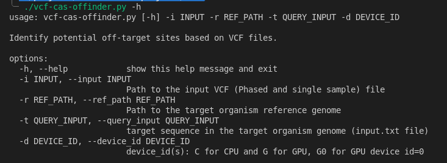

Quick Start
===========

Quick Start to use the web interface
------------------------------------

1. Navigate to https://crispr.pnucolab.com/
2. Download the provided **Sample VCF file**
3. Default settings:

   - Target Genome: Homo sapiens (GRCh38/hg38)
   - PAM Type: SpCas9 from Streptococcus pyogenes: 5'-NRG-3'
   - Query Sequence: CAGCAACTCCAGGGGGCCGC
   - Mismatches: 3

4. Click Submit to process the sample file.
5. For custom analysis, upload your phased single-sample VCF file.
6. For faster execution, upload a VCF file containing a few chromosomes, like chr1 and chr2, by filtering them using the command:

   .. code-block:: bash

      bcftools view -r chr6,chr10 NA12878.vcf.gz -o Output.vcf.gz

Quick Start to use the CLI
------------------------------------

Create a conda environment

::

   conda create -n varcasoffinder

Activate the conda environment:

::

   conda activate varcasoffinder

Install all dependencies

::

   pip install -r requirements.txt

Then for help, run:

::

   ./vcf-cas-offinder.py -h

